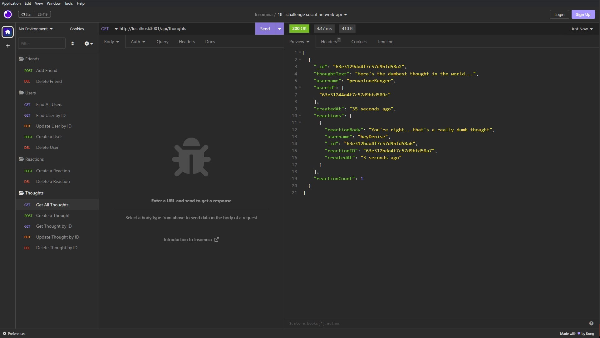

# social-network-api

## Description
This project is the backend of a theoretical social network. It was created to simulate the routes and controllers needed for an application with ``Friends``, ``Thoughts``, and ``Reactions`` to ``Thoughts``.

## Table of Contents
- [Installation](#installation)
- [Usage](#usage)
- [Credits](#credits)
- [License](#license)
- [Questions](#questions)

## Installation
An API development platform like ``Insomnia`` is required to run these paths as there is no front end in place.

## Usage
In your terminal do an ``npm install`` to download the necessary dependencies and then launch the server via ``nodemon`` or ``npm run start``. Enter data with the necessary key values and pretend like your fake users are friends.

## Credits
N/A

## License
N/A

## Questions
Please send any questions about this application to hayden.nease@gmail.com or follow my work at https://github.com/HaydenNease/
